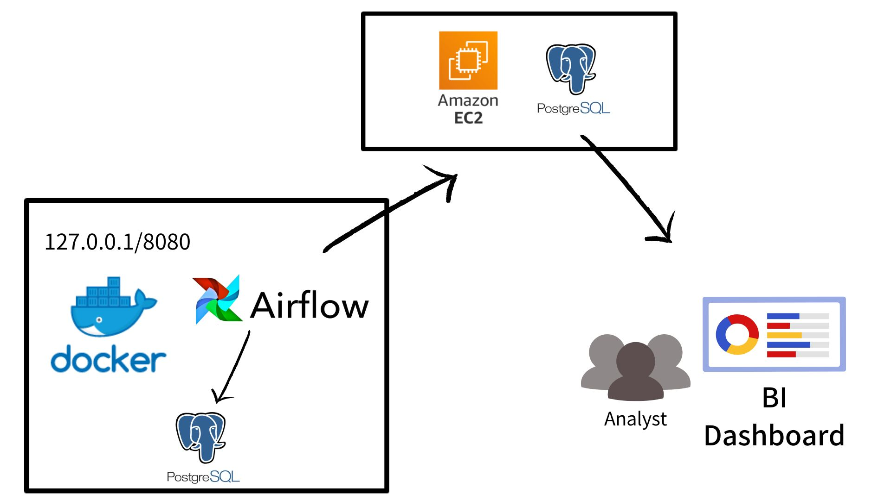

# Shark

Welcome to the Shark project.🦈🦈  
It is a side-project, using `Airflow` to maintain the data demand and manage the data pipeline.

---

## Framework

### Ready Data
- Houses for Rent
---

## Tag Definition

- 格式：`v{Large Version}.{Feature Version}.{Hotfix Version}` (Ex: v1.1.1)
- 定義：
    - Large Version: 若有**巨大**變動時，推進此版本號。
    - Feature Version: 新功能的版本號，如果有新功能上線，推進此版本號。
    - Hotfix Version: 若有緊急的 issue 需要處理，在修正後，推進此版本號。

---

## Environment

### Production

1. Airflow: http://localhost:8080

---

## Airflow Documentation

### Guidance
https://airflow.apache.org/docs/apache-airflow/2.3.4/tutorial.html

### Command Line Interface
https://airflow.apache.org/docs/apache-airflow/2.3.4/cli-and-env-variables-ref.html